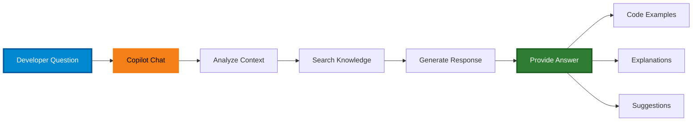

# Part 1: GitHub Copilot Ask Mode (20 minutes)

## Overview
Learn to use Copilot as a conversational coding assistant for understanding code, learning concepts, and getting debugging help.

## What is Ask Mode?
Ask mode is the conversational interface of GitHub Copilot. It's ideal for:
- Understanding unfamiliar code
- Getting explanations of concepts
- Asking for code examples (without editing files)
- Learning best practices
- Debugging assistance

**How to Access:**
- **Keyboard shortcut:** `Ctrl+Alt+I` (Windows/Linux) or `Cmd+Alt+I` (Mac)
- **Copilot Chat pane:** Click the chat icon in the sidebar - this is the default mode
- **Context menu:** Right-click code → **Copilot** → **Explain This**



## Exercises

### Exercise 1.1: Code Explanation (5 min)

**File:** `mystery_code.py`

**Task:** Use Ask mode to understand what this code does WITHOUT looking at the implementation details first.

**Steps:**
1. Open the file `mystery_code.py`
2. Select all the code (`Ctrl+A`)
3. Right-click → **Explain**
4. Read Copilot's explanation

**Questions to ask Copilot:**
```
What does this code do?
What is a ShoppingCart class used for?
How does the calculate_total() method work?
What would happen if I add_discount(20)?
Could you show me how to add a new item to this cart?
```

---

### Exercise 1.2: Learning Concepts (5 min)

**Task:** Use Copilot to learn about a new concept.

**Sample Questions:**
```
Explain what async/await does in Python

Show me an example of the decorator pattern in Python

What's the difference between deepcopy and shallow copy?

How do I handle exceptions properly in Python?

What are context managers and when should I use them?
```

**Your Turn:** Pick a Python/JavaScript concept you're unfamiliar with and ask Copilot to explain it.

**Note:**
- Clarity of explanation
- Quality of examples
- Accuracy of information

---

### Exercise 1.3: Debugging Assistant (10 min)

**File:** `buggy_code.py`

**Task:** Use Copilot to help debug code with errors.

**Steps:**
1. Open `buggy_code.py`
2. Read the code and try to spot bugs
3. Right-click → **Copilot** → **Review and Comment**

4. Compare Copilot's findings with yours
5. Ask follow-up questions:
   ```
   Why is [specific issue] a problem?
   How should I fix [specific bug]?
   What testing would catch these bugs?
   ```
6. Right-click → **Copilot** → **Fix This**
7. In the Terminal, run the code. 
    ```
    cd part1_ask_mode    # from the lab folder, lectures-and-labs/week06/agents_lab
    python buggy_code.py
   ```

**Questions for Reflection:**
- Did Copilot catch all the bugs?
- Were the explanations clear?
- Did it suggest good fixes?
- What did Copilot miss (if anything)?

---

## Best Practices for Ask Mode

✅ **DO:**
- Be specific in your questions
- Provide context about your project
- Ask follow-up questions
- Verify information from multiple sources
- Use it for learning and understanding

❌ **DON'T:**
- Blindly trust all answers
- Skip understanding the explanations
- Use it as a replacement for documentation
- Forget to test suggested solutions

---

## Next Steps
When you're done with Part 1, move on to `part2_edit_mode` for Edit Mode!
