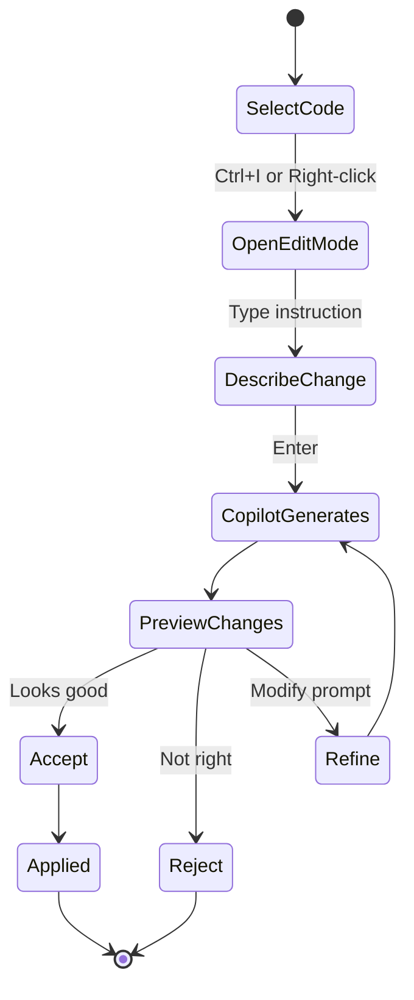

# Part 2: GitHub Copilot Edit Mode (25 minutes)

## Overview
Learn to generate and modify code directly in files using Copilot's Edit Mode for quick, focused changes.

## What is Edit Mode?
Edit mode lets you make quick edits to a specific code selection. It's ideal for:
- Generating single functions or classes
- Refactoring a specific function
- Fixing bugs in selected code
- Adding docstrings or comments
- Quick code improvements

**How to Access:**
- **Keyboard shortcut:** `Ctrl+I` (Windows/Linux) or `Cmd+I` (Mac) - quick inline access
- **Copilot Chat pane:** Open chat, then select **Edit** from the dropdown menu at the top
- **Context menu:** Select code → Right-click → **Copilot** → **Start Editing**

> 💡 **Tip:** The keyboard shortcut `Ctrl+I` is just a convenient way to quickly access Edit mode without opening the chat pane!



## Exercises

### Exercise 2.1: Code Generation (10 min)

**File:** `validators.py` (currently empty)

**Task:** Generate a new data validation class.

**Steps:**
1. Open `validators.py`
2. Press `Ctrl+I` (Windows/Linux) or `Cmd+I` (Mac) to open inline edit
3. Type this instruction:
   ```
   Create an EmailValidator class with a validate_email method that checks 
   email format using regex. Include docstrings and type hints.
   ```
4. Review the generated code
5. Click **Accept** if it looks good, or **Reject** to try again

**Refinement:** Select the class again and ask to:
```
Add a method to extract the domain from an email address
```

---

### Exercise 2.2: Refactoring (10 min)

**File:** `messy_code.py`

**Task:** Refactor poorly written code to follow best practices.

**Steps:**
1. Open `messy_code.py`
2. Select the entire function
3. Press `Ctrl+I` / `Cmd+I`
4. Give instructions:
   ```
   Refactor this code to:
   - Follow PEP 8 style guidelines
   - Use meaningful variable names
   - Add type hints
   - Add docstrings
   - Improve error handling
   - Break into smaller functions if needed
   ```

**Compare:** 
- Before and after versions
- Readability improvements
- What changed and why

---

### Exercise 2.3: Bug Fixing (5 min)

**File:** `broken_calculator.py`

**Task:** Fix bugs in existing code using Edit mode.

**Steps:**
1. Open `broken_calculator.py`
2. Select the buggy function
3. Use `Ctrl+I` / `Cmd+I`:
   ```
   Fix all bugs in this function and add input validation
   ```

4. Review changes carefully
5. Test the fixed code

---

## Edit Mode vs Agent Mode

**Use Edit Mode (`Ctrl+I`) when:**
- ✅ Editing a single function or class
- ✅ Making focused changes to selected code
- ✅ Quick refactoring of one section
- ✅ Adding/fixing a specific feature

**Use Agent Mode (`Ctrl+Shift+I`) when:**
- ✅ Creating multiple related files
- ✅ Making changes across several files
- ✅ Building complete features
- ✅ Need autonomous planning and execution

## Best Practices for Edit Mode

✅ **DO:**
- Select the specific code section you want to change
- Review ALL generated code carefully
- Test generated code before moving on
- Be specific in your instructions
- Use it for quick, focused changes

❌ **DON'T:**
- Accept code without understanding it
- Use it for multi-file changes (use Agent Mode instead)
- Use vague instructions
- Skip testing
## Next Steps
When you're done with Part 2, move on to `part3_agent_mode` for Agent Mode!
