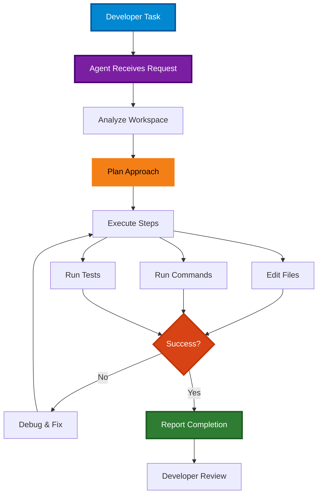

# Part 3: GitHub Copilot Agent Mode (25 minutes)

## Overview
Use Copilot's autonomous capabilities for complex, multi-file tasks that require planning and execution.

## What is Agent Mode?
Agent mode gives Copilot the ability to:
- Navigate your workspace autonomously
- Edit multiple files
- Run terminal commands
- Execute tests
- Fix errors iteratively

**How to Access:**
- **Keyboard shortcut:** `Ctrl+Shift+I` (Windows/Linux) or `Cmd+Shift+I` (Mac) - quick access
- **Copilot Chat pane:** Open chat, then select **Agent** from the dropdown menu at the top

> 💡 **Tip:** You'll see a dropdown menu in the Copilot Chat pane with options: **Chat**, **Edit**, and **Agent**. The keyboard shortcuts are just quick ways to access these modes!



## Exercises

### Exercise 3.1: Multi-step Feature Implementation (15 min)

**Task:** Have the agent build a complete task management system with tests.

**Steps:**
1. Open Agent mode:
   - **Option A:** Press `Ctrl+Shift+I` (quick shortcut)
   - **Option B:** Open Copilot Chat (`Ctrl+Alt+I`), then select **Agent** from the dropdown
2. Enter this task:

```
Create a task management system with:

1. Task class (task.py) with:
   - id, title, description, status, priority, created_at
   - Methods: mark_complete(), update_priority(), to_dict()

2. TaskManager class (task_manager.py) with:
   - add_task(), remove_task(), get_task(), list_tasks()
   - filter_by_status(), filter_by_priority()
   - save_to_json(), load_from_json()

3. Unit tests (test_tasks.py) covering all functionality

4. CLI interface (cli.py) with argparse for:
   - add, list, complete, delete commands

Use type hints and docstrings throughout.
```

4. **Watch the Agent Work:**
   - See which files it creates/modifies
   - Observe the plan it makes
   - Monitor progress in the chat

5. **Review the Results:**
   - Check each file
   - Run the tests
   - Try the CLI

---

### Exercise 3.2: Enhance an Existing Feature (10 min)

**Task:** Have the agent add new functionality to the task manager it just created.

**Steps:**
1. Open Agent mode (use either `Ctrl+Shift+I` or select **Agent** from the Copilot Chat dropdown)
2. Enter:

```
Enhance the task manager with these new features:

1. Add a due_date field to tasks (use datetime)
2. Add a method to get overdue tasks
3. Add a method to get tasks due today
4. Add command line options for:
   - list-overdue
   - list-today
5. Update tests to cover the new functionality

Make sure all existing tests still pass.
```

3. **Observe:**
   - How does the agent read and understand the existing code?
   - Does it modify existing files correctly?
   - Does it maintain the existing style and patterns?
   - How does it handle updating tests?

4. **Verify:**
   - Run the updated tests
   - Try the new CLI commands
   - Check that old functionality still works

---

## When to Use Agent Mode

### Good Use Cases:
- ✅ Implementing complete features
- ✅ Refactoring across multiple files
- ✅ Adding comprehensive tests
- ✅ Investigating complex bugs
- ✅ Updating dependencies
- ✅ Applying patterns across codebase

### Poor Use Cases:
- ❌ Simple single-line changes
- ❌ When you need to learn/understand
- ❌ Making critical security changes
- ❌ Very vague requirements
- ❌ Experimenting with ideas

---

## Tips for Success

1. **Be Specific**: Provide clear, detailed requirements
2. **Review Everything**: Check all generated files carefully
3. **Test Thoroughly**: Run tests and manual verification
4. **Iterate**: Ask for improvements if needed
5. **Learn**: Understand what the agent did and why

---

## Next Steps
When you're done with Part 3, move on to `part4_cloud_agent` for the Cloud Coding Agent!
