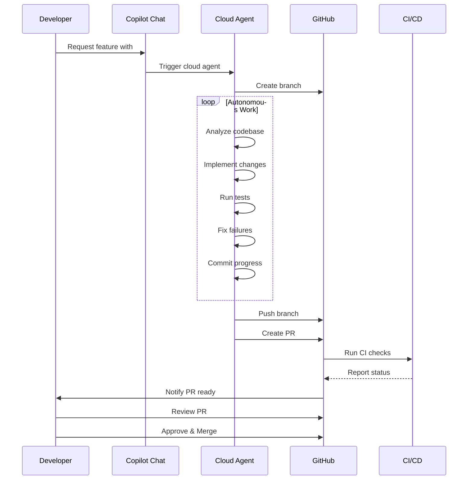

# Part 4: Cloud Coding Agent (30 minutes)

## Overview
Use GitHub Copilot's cloud agent for fully autonomous development that works asynchronously.

## What is the Cloud Coding Agent?

The cloud coding agent runs completely autonomously in GitHub's infrastructure:
- Works asynchronously (you don't wait)
- Creates a new branch automatically
- Implements the feature independently
- Runs tests and fixes errors
- Opens a PR when complete



## Exercises

### Exercise 4.1: Trigger a Cloud Agent Task (10 min)

**Task:** Have the cloud agent implement a new feature autonomously.

**Steps:**

1. **In Copilot Chat**, type:

```
#github-pull-request_copilot-coding-agent

Create a user authentication system with:

- User registration with password hashing (bcrypt)
- Login with JWT token generation
- Password reset functionality
- Email validation
- Unit tests with >80% coverage
- README documentation

Use Flask for the web framework and SQLite for storage.
```

2. **What Happens:**
   - Copilot will confirm it's starting the cloud agent
   - You'll see a message like: "Coding agent will continue work in #17"
   - The agent works independently
   - You can continue other work

3. **Monitor Progress:**
   - You'll receive notifications as the agent works
   - Can check the branch being created
   - View commits in real-time

---

### Exercise 4.2: Review the PR (10 min)

**Task:** Review the pull request created by the agent.

**Review Checklist:**

```markdown
Files Changed:
- [ ] All required files created
- [ ] Code follows best practices
- [ ] Proper error handling
- [ ] Type hints used
- [ ] Docstrings present

Tests:
- [ ] Tests exist and pass
- [ ] Edge cases covered
- [ ] Good test coverage

Documentation:
- [ ] README updated
- [ ] Clear instructions
- [ ] Examples provided

Security:
- [ ] Passwords properly hashed
- [ ] No hardcoded secrets
- [ ] Input validation present
```

**Steps:**
1. Navigate to the PR (click notification link)
2. Review each file thoroughly
3. Run the tests locally if possible
4. Check security considerations
5. Provide feedback via comments

---

### Exercise 4.3: Iterate with the Agent (10 min)

**Task:** Request improvements to the PR.

**Steps:**

1. **In the PR comments**, tag Copilot:

```
@github-copilot Please add:
- Rate limiting for login attempts
- Account lockout after 5 failed attempts
- Email verification on registration
- Update tests accordingly
```

2. **Watch the Agent:**
   - It will add new commits to the PR
   - Implement the requested changes
   - Update tests
   - Push updates

3. **Final Review & Merge:**
   - Review the additional changes
   - Merge when satisfied
   - Or request more changes

---

## Cloud Agent Best Practices

### ✅ Effective Task Descriptions:

**Good ✅:**
```
Create a REST API for a library system with:
- Book CRUD operations (title, author, ISBN, status)
- Borrower management
- Checkout/return functionality
- SQLite persistence
- 80%+ test coverage
- OpenAPI documentation
```

**Too Vague ❌:**
```
Make a library app
```

### When to Use Cloud Agent:
- ✅ Large features that take >30 minutes
- ✅ When you want to work on other things
- ✅ Complete new modules
- ✅ Comprehensive test suites
- ✅ Documentation generation

### When NOT to Use:
- ❌ Quick fixes (use Edit mode)
- ❌ Learning exercises (use Ask mode)
- ❌ Experimental changes
- ❌ Critical security patches

---

## Troubleshooting

**Problem:** Cloud agent doesn't start
**Solutions:**
- Ensure you use the exact tag: `#github-pull-request_copilot-coding-agent`
- Check repository permissions
- Verify Copilot subscription includes cloud features

**Problem:** PR not created
**Solutions:**
- Wait longer (can take 10-30 minutes)
- Check GitHub Actions logs
- Verify branch permissions

---

## Next Steps
When you're done with Part 4, move on to `part5_google_jules` for Google Jules!
