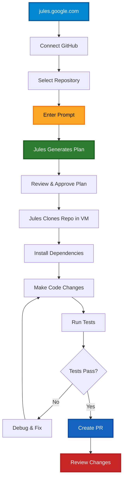

# Part 5: Google Jules AI Coding Agent (20 minutes)

## Overview
Compare Google's Jules with GitHub Copilot by implementing a feature using Jules' issue-driven workflow.

## What is Google Jules?

Google Jules is an AI coding agent that:
- Works through the jules.google.com web interface
- Connects to your GitHub repositories
- Works asynchronously in a virtual machine
- Autonomously implements fixes/features
- Creates pull requests
- Competes with GitHub Copilot's cloud agent



## Exercises

### Exercise 5.1: Create Your Own Repository (5 min)

**Task:** Create a new personal GitHub repository for Jules to work on.

**Steps:**

1. **Go to GitHub.com** and sign in to your personal account

2. **Create a new repository:**
   - Click the **+** icon → **New repository**
   - Name: `simple-todo-app`
   - Description: `A simple todo application for testing Jules`
   - Public or Private both work: Jules asks for access to your repositories
     when you connect your GitHub account
   - Check **Add a README file**
   - Add Python `.gitignore`
   - Choose a license (MIT recommended)
   - Click **Create repository**

3. **Create initial code structure:**
   - Click **Add file** → **Create new file**
   - Filename: `todo.py`
   - Add this basic code:
   
   ```python
   """Simple TODO list application."""
   
   class TodoList:
       def __init__(self):
           self.todos = []
       
       def add_todo(self, task):
           """Add a new todo item."""
           self.todos.append({'task': task, 'completed': False})
       
       def list_todos(self):
           """List all todos."""
           return self.todos
   
   if __name__ == "__main__":
       todo_list = TodoList()
       todo_list.add_todo("Learn about Jules")
       print(todo_list.list_todos())
   ```
   
   - Commit the file

> 💡 **Why your own repo?** Jules works best on repositories you own, where you have full control over issues and permissions.

### Exercise 5.2: Set Up Jules (5 min)

**Task:** Connect Jules to your GitHub account and repository.

**Steps:**

1. **Visit Jules:**
   - Go to [jules.google.com](https://jules.google.com)
   - Sign in with your Google account
   - Accept the privacy notice (one-time)

2. **Connect GitHub:**
   - Click **Connect to GitHub account**
   - Complete the GitHub login flow
   - Choose to connect **all repositories** or select specific ones
   - Make sure your `simple-todo-app` repo is included
   - You'll be redirected back to Jules

3. **Verify Connection:**
   - You should see a repository selector
   - Find your `simple-todo-app` in the dropdown
   - You should see a prompt input box ready to use

> 💡 **Tip:** If Jules doesn't redirect you back, try refreshing the jules.google.com page.

---

### Exercise 5.3: Give Jules a Task (5 min)

**Task:** Ask Jules to add JSON persistence to your todo app.

**Steps:**

1. **Select your repository:**
   - In the repo selector, choose `simple-todo-app`
   - Choose the branch (default is `main` - leave it as is)

2. **Write a clear prompt:**
   ```
   Add JSON file persistence to the TodoList class:
   - Add save_to_file(filename) method to save todos to JSON
   - Add load_from_file(filename) method to load todos from JSON
   - Default filename should be "todos.json"
   - Handle file not found errors gracefully (start with empty list)
   - Handle JSON parsing errors
   - Auto-save after each add_todo() call
   - Add tests for the new functionality
   - Make sure existing functionality still works
   ```

3. **Click "Give me a plan"**

4. **Review Jules' plan:**
   - Jules will analyze your code
   - Generate a detailed plan
   - Show you what changes it will make
   - **Review the plan carefully**

5. **Approve the plan:**
   - If the plan looks good, approve it
   - Jules will start working in its virtual machine
   - You can close the browser and come back later

6. **Watch progress (optional):**
   - Jules works asynchronously
   - You can monitor its progress on the jules.google.com interface
   - You'll see it cloning, installing dependencies, making changes

**Note:** Jules is experimental and availability varies by user and organisation. If you cannot access it, use the alternative exercise below.

---

### Exercise 5.4: Review Jules' Work (5 min)

**Task:** Compare Jules' approach to what you've learned about Copilot.

**Steps:**

1. **Review the PR:**
   - Navigate to the Pull Request Jules created
   - Check the code changes
   - Look at the commit messages
   - Review any tests added

2. **Compare with Copilot Cloud Agent (Part 4):**
   - Which was easier to trigger?
   - Which provided better code quality?
   - Which had clearer communication?
   - Which would you prefer to use and why?

3. **Test locally (optional):**
   - Clone your repo
   - Checkout Jules' branch
   - Run the code
   - Verify it works as expected

---

## Alternative Exercise (If Jules Not Available)

If Jules is not available in your environment:

1. **Create the same feature request issue**
2. **Use GitHub Copilot Cloud Agent instead** (Part 4)
3. **Document observations** about Jules based on:
   - The Copilot experience
   - Jules' advertised capabilities
   - Your ideal workflow

4. **Note key differences** based on:
   - Documentation and demos
   - Workflow approaches
   - Your preferences

---

## Key Observations to Note

Document these in your code samples/notes:

1. **Workflow Preference:**
   - Do you prefer issue-driven (Jules) or chat-driven (Copilot) workflow?
   - Why?

2. **Integration:**
   - Which integrates better with your workflow?
   - What are the trade-offs?

3. **Quality:**
   - Were there quality differences?
   - Which produced better code?

4. **Future:**
   - Would you use both or choose one?
   - What features would you want added?

---

## Next Steps
Congratulations! You've completed all 5 parts of the AI Coding Agents lab. You now have hands-on experience with multiple AI coding assistants!
